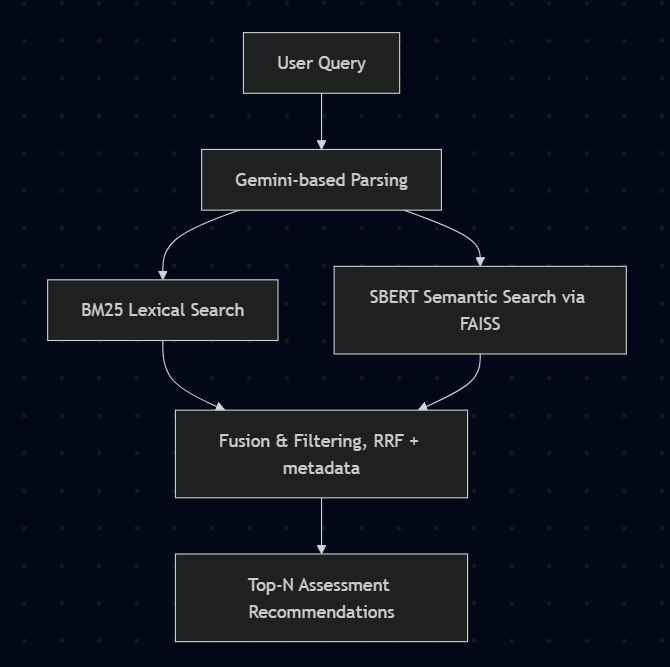

# SHL Assessment Recommender System


This project implements an intelligent recommendation system that suggests the most relevant SHL assessments based on a natural language job description or hiring requirement. It combines modern Information Retrieval (IR) techniques—including semantic embeddings, BM25 lexical search, and metadata-based filtering—into a hybrid pipeline. The goal is to retrieve and rank SHL assessments in a context-aware, efficient, and scalable manner.
This achieves a **Recall@10 of 0.3, and an MAP@10 of 0.2**, which is competitive given the zero-shot pre-trained model.

The link to the end-to-end webpage can be found below:
[Website URL](https://assessment-recommender-shl.streamlit.app/)

**Note:**
Querying the backend may take **upto 20s** in extreme cases due to HF Spaces hosting bottleneck (shared CPU), the system performs with latency <1.5s locally.

---

## Key Features

- **Hybrid Retrieval Pipeline:** Combines BM25 (lexical) and SBERT (semantic) search.
- **RAG-Augmented Processing:** Integrates Google Gemini API for advanced query parsing.
- **FAISS Indexing:** Fast similarity search using dense vector embeddings.
- **Metadata Filtering:** Based on test type, adaptiveness, and duration.
- **Reciprocal Rank Fusion (RRF):** Fuses scores from multiple retrieval pipelines.
- **Evaluation Metrics:** Supports Recall@10 and MAP@10 for model evaluation.
- **Web Application:** Accessible via FastAPI (backend) and Streamlit (frontend).

---

## System Architecture



[My Approach](notebook/Approach.md) and the [Development process](notebook/shl-recommendation-system.ipynb) can be found in the given links.
---

## Evaluation

The system was evaluated on SHL's provided test set:

- **Recall@10:** 0.30
- **MAP@10:** 0.21

These results were achieved without any supervised training. Future improvements could involve classifier ensembling or reranking using domain-specific fine-tuning.

---

## Data Processing

- Assessments scraped from: [SHL Product Catalog](https://www.shl.com/solutions/products/product-catalog/) (See [scrape.py](scripts/scrape.py))
- Extracted Fields:
  - `data-entity-id`
  - `Assessment Name`
  - `Relative URL`
  - `Remote Testing Support`
  - `Adaptive/IRT Support`
  - `Test Type`
  - `Assessment Length/Duration`

- Data was cleaned, deduplicated, enriched with additional metadata, and stored as CSV. Within a kaggle environment, it was then cleaned and processed and the resulting dataframe saved in `/scripts/df_clean.pkl`.

---

## Embedding & Indexing

- Sentence embeddings generated using **SBERT** (`all-mpnet-base-v2`).
- Dense vector index created using **FAISS** for semantic similarity.
- Gemini used to process queries and extract key constraints (e.g., duration, test type).
- Metadata filtering applied after retrieval.

---

## API Endpoints

The backend can be accessed through the base url: [https://adityachopra0306-shl-recommender.hf.space/](https://adityachopra0306-shl-recommender.hf.space/). HuggingFace Space has been used for hosting.

The backend is served via FastAPI with the following endpoints:

- `GET /health`: Health check endpoint
- `POST /recommend`: Lightweight query → top assessments (used for API, curls)
- `POST /recommend_full`: Query parsing + retrieval + filtering (used by frontend)

### Example Request

```http
POST /recommend
Content-Type: application/json

{
  "query": "I need a 30 to 40 minute test to evaluate .NET Framework skills for remote hiring."
}
```

```cmd
curl -X POST -H "Content-Type: application/json" -d "{\"query\":\"I need a 30 to 40 minute test to evaluate .NET Framework skills for remote hiring.\"}" https://adityachopra0306-shl-recommender.hf.space/recommend
```

### Example Response

```json
{
  "recommended_assessments": [
    {
      "url": "https://www.shl.com/products/product-catalog/view/net-framework-4-5/",
      "adaptive_support": "yes",
      "description": "The.NET Framework 4.5 test measures knowledge of .NET environment. Designed for experienced users, this test covers the following topics: Application Development, Application Foundation, Data Modeling, Deployment, Diagnostics, Performance, Portability, and Security.",
      "duration": 30,
      "remote_support": "yes",
      "test_type": ["Knowledge & Skills"],
    },
    ...
  ]
}
```

---

## Web Application

A responsive frontend is built with **Streamlit** and connects to the FastAPI backend. Users can input natural language queries and receive real-time recommendations with detailed assessment metadata.

---

## Evaluation Pipeline

Evaluation was performed using:

- Official test set with job descriptions and expected assessments.
- Metrics:
  - **Recall@10**
  - **MAP@10**

No supervised learning was used—making this model robust, scalable, and zero-shot compatible.

---

## Known Limitations

- Semantic matching struggles on abstract or managerial queries.
- Latency increases with Gemini calls (can be mitigated via caching or offline pre-parsing).
- No personalization or adaptive reranking (future scope).

---

## Future Work

- Fine-tune embeddings or train a classifier for domain adaptation.
- Add caching and rate-limiting for Gemini API.
- Incorporate user feedback loop for online learning.
- Explore integration with resume parsers and ATS systems.

---

## Repository Structure

```
shl-recommender/
├── app/
│   ├── __init__.py
│   ├── model.py
│   ├── api.py
│   ├── ui.py
├── data/
│   ├── df_bm25_tokenized.pkl
│   ├── df_clean.pkl
│   ├── faiss_index.bin
├── notebook/
│   ├── shl-recommendation-system.ipynb
│   ├── Approach.md
├── scripts/
│   ├── scrape.py
│   ├── TestSet.py
├── streamlit_app.py
├── nltk_data/
│   ├── ...
├── graph.png
├── requirements.txt
├── README.md
```

---

### License

This project is licensed under the **MIT License**. See the [LICENSE](./LICENSE) file for details.

> **Disclaimer:** This project is intended for educational and evaluation purposes only. It is **not affiliated with SHL**, and all product data used was obtained from publicly accessible sources on the SHL website.

---

## Links

- [SHL Product Catalog](https://www.shl.com/solutions/products/product-catalog/)
- [Gemini API](https://ai.google.dev/)
- [FAISS](https://github.com/facebookresearch/faiss)
- [SBERT](https://www.sbert.net/)
